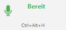
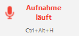
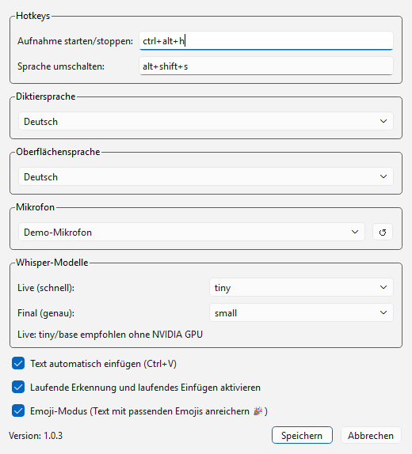
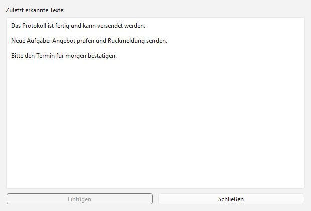
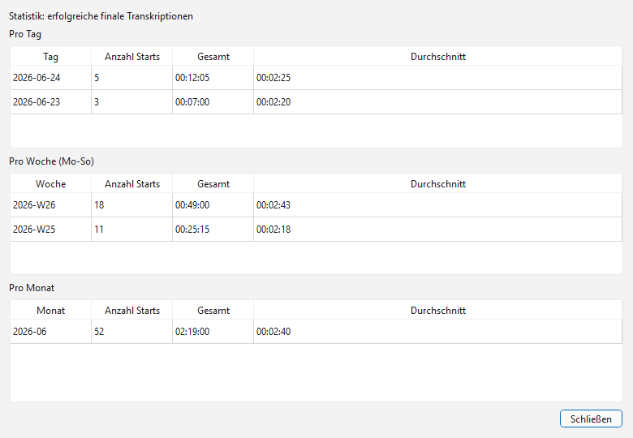

# WinWhisperPlus Benutzerhandbuch

Dieses Handbuch beschreibt die Bedienung von WinWhisperPlus Version 1.0.3. WinWhisperPlus ist ein Windows-Tool für lokale Spracherkennung mit OpenAI Whisper. Die Aufnahme wird lokal verarbeitet; nach der Erkennung kann der Text automatisch in das aktive Eingabefeld eingefügt werden.

## Überblick

WinWhisperPlus läuft im Hintergrund und zeigt ein kleines Statusfenster sowie ein Symbol im Windows-Infobereich. Die wichtigsten Aufgaben sind:

- Sprache aufnehmen und in Text umwandeln.
- Den erkannten Text automatisch per Zwischenablage einfügen.
- Zwischen Deutsch, Polnisch und Englisch als Diktiersprache wechseln.
- Hotkeys, Mikrofon, Oberflächensprache und Whisper-Modelle konfigurieren.
- Vorherige Transkriptionen aus dem Verlauf erneut einfügen.
- Nutzungsstatistiken für erfolgreiche finale Transkriptionen anzeigen.

## Installation und erster Start

Verwenden Sie das bereitgestellte Setup. Nach der Installation starten Sie `WinWhisperPlus.exe`. Beim ersten Start kann Whisper das ausgewählte Modell herunterladen; dafür ist einmalig Internetzugriff erforderlich. Danach liegen Modell, Einstellungen und Statistikdaten lokal.

Nach dem Start erscheint das kleine Statusfenster. Die Anwendung bleibt aktiv, auch wenn kein großes Hauptfenster geöffnet ist.



## Statusfenster und Menü

Das Statusfenster zeigt den aktuellen Zustand der Anwendung:

- `Bereit`: WinWhisperPlus wartet auf eine Aufnahme.
- `Aufnahme läuft`: Das Mikrofon wird aufgenommen.
- `Verarbeitung läuft`: Die Aufnahme wird transkribiert.
- `Text eingefügt`: Der erkannte Text wurde eingefügt.
- `Initialisierung` oder `Modelle laden...`: Die App oder Whisper-Modelle werden vorbereitet.

Im unteren Bereich des Statusfensters steht der Aufnahme-Hotkey. Mit Rechtsklick auf das Statusfenster oder über das Tray-Symbol öffnen Sie das Menü mit diesen Einträgen:

- `Aufnahme starten` oder `Aufnahme stoppen`
- `Verlauf...`
- `Statistiken...`
- `Einstellungen...`
- `Beenden`



## Aufnahme starten und stoppen

Standardmäßig starten oder stoppen Sie eine Aufnahme mit `Ctrl+Alt+H`. Alternativ verwenden Sie den Menüpunkt `Aufnahme starten` im Kontextmenü. Während der Aufnahme spricht man den gewünschten Text ein; beim Stoppen wird die Aufnahme final transkribiert.

Wenn `Text automatisch einfügen` aktiviert ist, setzt WinWhisperPlus den erkannten Text per `Ctrl+V` in das aktuell aktive Eingabefeld ein. Klicken Sie daher vor dem Stoppen oder vor dem finalen Einfügen in das Zielprogramm, zum Beispiel Editor, E-Mail, Browser oder Fachanwendung.

Der Hotkey `Alt+Shift+S` schaltet die Diktiersprache in der Reihenfolge Deutsch, Polnisch, Englisch um. Nach dem Umschalten zeigt das Statusfenster kurz die neue Sprache an.

## Einstellungen

Öffnen Sie `Einstellungen...`, um das Verhalten der Anwendung anzupassen.



Die wichtigsten Optionen:

- `Aufnahme starten/stoppen`: Hotkey für die Aufnahme. Klicken Sie in das Feld und drücken Sie die gewünschte Tastenkombination.
- `Sprache umschalten`: Hotkey für den Wechsel der Diktiersprache.
- `Diktiersprache`: Sprache, in der Whisper die Aufnahme interpretieren soll.
- `Oberflächensprache`: Sprache der Benutzeroberfläche. Verfügbar sind Deutsch, Polnisch und Englisch.
- `Mikrofon`: Eingabegerät. `System-Standard` verwendet das Windows-Standardmikrofon.
- `Live (schnell)`: Modell für laufende Live-Erkennung. `tiny` und `base` sind für kurze Latenz vorgesehen.
- `Final (genau)`: Modell für die abschließende Transkription. Größere Modelle sind genauer, brauchen aber mehr Zeit und Leistung.
- `Text automatisch einfügen`: Fügt erkannte Texte automatisch in das aktive Eingabefeld ein.
- `Laufende Erkennung und laufendes Einfügen aktivieren`: Fügt stabile Zwischenergebnisse während der Aufnahme ein.
- `Emoji-Modus`: Ergänzt bekannte Schlüsselwörter im erkannten Text mit passenden Emojis.

Speichern übernimmt die Einstellungen sofort und registriert die Hotkeys neu.

## Live-Erkennung

Die Live-Erkennung ist optional. Wenn sie aktiviert ist, transkribiert WinWhisperPlus während der laufenden Aufnahme überlappende Audiostücke und fügt stabile Zwischenergebnisse ein. Beim Stoppen ersetzt die finale Transkription den Live-Textblock durch das endgültige Ergebnis.

Für Live-Erkennung ohne schnelle GPU sind kleine Modelle sinnvoll. Beginnen Sie mit `tiny`; wenn die Qualität nicht reicht, testen Sie `base`.

## Verlauf

Der Verlauf zeigt zuletzt erkannte Texte der aktuellen Sitzung. Der neueste Eintrag steht oben. Markieren Sie einen Eintrag und klicken Sie auf `Einfügen`, oder doppelklicken Sie auf den Eintrag, um ihn erneut in das aktive Zielprogramm einzufügen.



Der Verlauf ist als Arbeitshilfe gedacht und enthält nur nicht-leere erkannte Texte. Beim Beenden der Anwendung wird dieser Sitzungsverlauf nicht als separate Historie dokumentiert.

## Statistiken

Die Statistik zeigt erfolgreiche finale Transkriptionen nach Tag, Woche und Monat. Angezeigt werden Anzahl Starts, Gesamtdauer und Durchschnittsdauer.



Die Werte helfen dabei, die Nutzung einzuschätzen und zu erkennen, ob viele kurze oder wenige lange Diktate verarbeitet wurden.

## Speicherorte

WinWhisperPlus speichert Benutzerdaten unter:

```text
%APPDATA%\WinWhisperPlus
```

Wichtige Dateien:

- `settings.json`: Hotkeys, Sprachen, Mikrofon, Modelle und weitere Einstellungen.
- `statistics.json`: Statistikdaten erfolgreicher finaler Transkriptionen.
- `winwhisperplus.log`: Laufzeitmeldungen und Fehlerhinweise.

Eine alte Konfiguration aus `%APPDATA%\MyWhisper\settings.json` kann beim Start übernommen werden, wenn noch keine neue WinWhisperPlus-Konfiguration existiert.

## Fehlerbehebung

### Das Modell wird beim ersten Start geladen

Beim ersten Einsatz eines Whisper-Modells kann ein Download notwendig sein. Warten Sie, bis die Initialisierung abgeschlossen ist. Wenn der Download blockiert wird, prüfen Sie Internetzugang, Proxy, Virenschutz und Firewall.

### Das Mikrofon fehlt in der Liste

Öffnen Sie die Einstellungen und klicken Sie auf die Aktualisieren-Schaltfläche neben der Mikrofonliste. Prüfen Sie außerdem, ob Windows das Mikrofon erkennt und ob die Datenschutzfreigabe für Mikrofonzugriff aktiv ist.

### Der Hotkey funktioniert nicht

Ein Hotkey kann von einer anderen Anwendung belegt sein oder unter Windows nicht global registriert werden. Wählen Sie in den Einstellungen eine andere Kombination und speichern Sie erneut.

### Der Text wird nicht eingefügt

Klicken Sie vor dem Stoppen der Aufnahme in das Ziel-Eingabefeld. Wenn das Zielprogramm Einfügen per Zwischenablage blockiert, deaktivieren Sie testweise `Text automatisch einfügen` und kopieren Sie den Text aus dem Verlauf.

### Die Transkription schlägt fehl

Öffnen Sie `%APPDATA%\WinWhisperPlus\winwhisperplus.log` und prüfen Sie die letzten Fehlermeldungen. Typische Ursachen sind ein nicht verfügbares Mikrofon, ein fehlgeschlagener Modell-Download oder zu wenig Speicher für ein großes Whisper-Modell.

### Die Erkennung ist zu langsam

Wählen Sie ein kleineres finales Modell, zum Beispiel `base` oder `small`. Für Live-Erkennung verwenden Sie `tiny` oder `base`. Eine NVIDIA-GPU kann die Verarbeitung deutlich beschleunigen, ist aber für die Grundfunktion nicht zwingend erforderlich.
